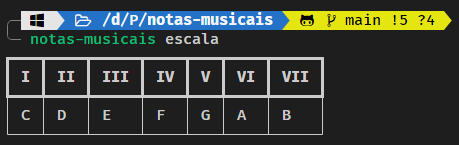
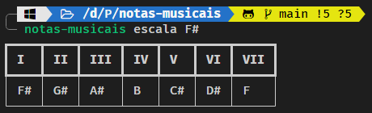
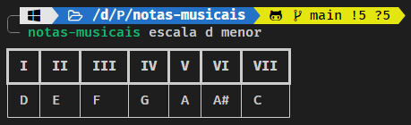
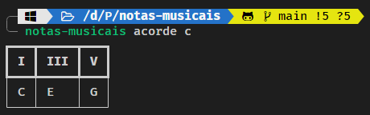

# Tutorial

Se você chegou até aqui, significa que quer aprender mais sobre o `notas-musicais`.

O objetivo desse projeto é ajudar estudantes de música ou profissionais a obter fácil acesso a escalas, formação de acordes e campos harmônicos. Cada uma dessas funcionalidades corresponde a um subcomando do nosso CLI.



## Comandos

O `notas-musicais` distribui cada função em um subcomando e você pode executar cada um deles para testar agora. O objetivo desse tutorial é explicar o básico do funcionamento da aplicação em linha de comando.

Os subcomandos são divididos em três funções até o momento:

- `escala`
- `acorde`
- `campo-harmonico`

Vamos entender o que cada um se propõe a fazer agora.

### Escalas

O subcomando `escala` nos auxilia a ter fácil acesso à formação das escalas musicais.

Caso seja invocado sem nenhum parâmetro, retornará a escala de **Dó maior**:

```bash
{{ commands.run }} escala
```

Com isso, será fornecida uma tabela no terminal informando a escala:

|  I  | II  | III | IV  |  V  | VI  | VIII |
| :-: | :-: | :-: | :-: | :-: | :-: | :--: |
|  C  |  D  |  E  |  F  |  G  |  A  |  B   |

Um exemplo no terminal:



#### Variações nas Escalas

Para alterar as escalas, você pode alterar os parâmetros: `tonica` e `tonalidade`. Eles são chamados na seguinte ordem:

```bash
{{ commands.run }} escala [TONICA] [TONALIDADE]
```

##### Variação da Tônica

A variação da tônica pode ser feita em qualquer nota. Por exemplo, se quisermos alteração da escala de **Fá sustenido**:

```bash
{{ commands.run }} escala F#
```

Isso nos fornecerá, o seguinte resultado:

|  I  | II  | III | IV  |  V  | VI  | VIII |
| :-: | :-: | :-: | :-: | :-: | :-: | :--: |
| F#  | G#  | A#  |  B  | C#  | D#  |  F   |

No terminal:



##### Variação da Tonalidade

Você pode alterar a tonalidade usando o segundo parâmetro. Por exemplo, a escala **menor** de **Ré**:

```bash
{{ commands.run }} escala d menor
```

Fornecendo a seguinte tabela:

|  I  | II  | III | IV  |  V  | VI  | VIII |
| :-: | :-: | :-: | :-: | :-: | :-: | :--: |
|  D  |  E  |  F  |  G  |  A  | A#  |  C   |

Um exemplo de visualização no terminal:



### Acordes

O subcomando `acorde` se baseia em mostrar quais graus estão relacionados dentro da escala maior. Ao passar uma cifra, a aplicação retorna quais são as notas contidas nesse acorde e os graus correspondentes.

Por exemplo, um acorde de **Ré menor aumentado** (**Dm+**):

```bash
{{ commands.run }} acorde Dm+
```

Retorna os graus e as notas referentes a esse acorde em relação à escala maior de Ré:

|  I  | III- | V+  |
| :-: | :--: | :-: |
|  D  |  F   | A#  |

Pontos a se observar em relação a essa resposta:

- O sinal de `-` simboliza um semitom a menos. Ou seja, para ser o acorde maior, necessitaria que `F` fosse um `F#`.
- O sinal de `+` simboliza um semitom a mais. Ou seja, para ser o acorde maior, necessitaria que `A#` fosse um `A`.

!!! warning "Sobre os acordes"
	Pode ser que os acordes que você busque ainda não tenham sido implementados. No momento da escrita desse tutorial, somente acordes de **tríade** foram implementados. Dessa forma você pode usar acordes:

    - Maiores
    - Menores
    - Aumentados
    - Diminutos
    - Menores diminutos

#### Outro Exemplo

Se quisermos ver um acorde **maior** de **Dó**, poderíamos passar sua cifra:

```bash
{{ commands.run }} acorde c
```

E ver o resultado:

|  I  | III |  V  |
| :-: | :-: | :-: |
|  C  |  E  |  G  |

Note que, nesse caso, não temos nenhuma variação entre graus, oois o acorde já é maior!

Um exemplo da visualização da tabela no terminal:



## Campos Harmônicos

Os campos harmônicos são as representações da escala com o uso de acordes. E seu subcomando, `campo-harmonico`, tem o uso idêntico ao da escala:

```bash
{{ commands.run }} campo-harmonico [TONICA] [TONALIDADE]
```

### Uso Básico

Caso o comando seja chamado sem nenhuma tônica, retornará o campo harmônico de **Dó maior**:

```bash
{{ commands.run }} campo-harmonico
```

Obtendo, assim, uma tabela com todos os acordes correspondentes a esse campo:

|  I  | ii  | iii | VI  |  V  | vi  | viiº |
| :-: | :-: | :-: | :-: | :-: | :-: | :--: |
|  C  | Dm  | Em  |  F  |  G  | Am  |  Bo  |

### Variação de Tônica

Você pode enviar a tônica do campo harmônico como o primeiro parâmetro. Como o campo harmônico **maior** de **Lá**:

```bash
{{ commands.run }} campo-harmonico A
```

Que retorna:

|  I  | ii  | iii | VI  |  V  | vi  | viiº |
| :-: | :-: | :-: | :-: | :-: | :-: | :--: |
|  A  | Bm  | C#m |  D  |  E  | F#m | G#o  |

### Variação de Tonalidade

O segundo parâmetro do comando de `campo-harmonico` é a tonalidade. Vamos pedir um campo harmônico **menor** de **Sol**:

```bash
{{ commands.run }} campo-harmonico G menor
```

Obteremos, então, a varição da tonalidade:

|  I  | ii  | iii | VI  |  V  | vi  | viiº |
| :-: | :-: | :-: | :-: | :-: | :-: | :--: |
| Gm  | Ao  | A#  | Cm  | Dm  | D#  |  F   |

## Para Saber Mais

Caso queira descobrir mais utilidades para os comandos, você pode usar a flag `--help` em todos os subcomandos.

Assim, para descobrir novas formas de usar o `notas-musicais`:

```bash
{{ commands.run }} [comando] --help
```
## Sobre esse Tutorial

Esse tutorial foi escrito em `2024-03-29`. Os comandos podem receber novas atualizações. Então, consultar a ajuda com a flag `--help` é uma boa maneira de se manter atualizado.

Caso tenha encontrado algum erro no tutorial ou deseje melhorar seu texto, fique a vontade para contribuir com o projeto no link a seguir.

[Como contribuir com o projeto?](02_contribua.md)

