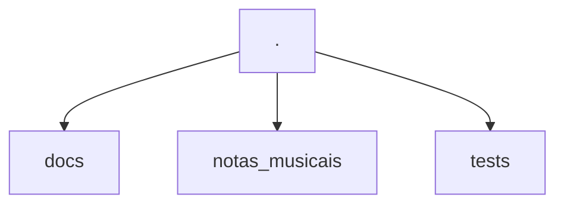
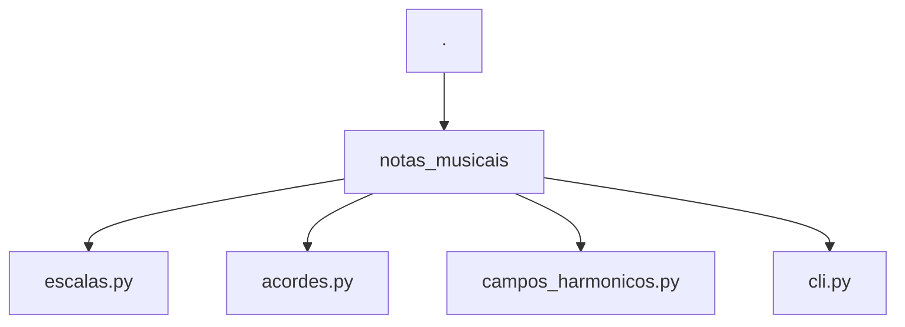
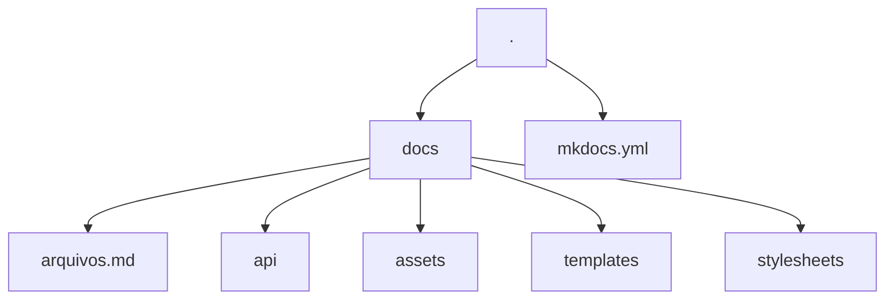

# Como Contribuir

Obrigado por se interessar por contribuir no projeto `notas-musicais` ❤️.
Nesse documento estão listadas as operações mais comuns e que você pode precisar para contribuir.

## Como o Projeto Funciona?

### Estrutura do Projeto



O projeto é dividido em três diretórios: `docs`, `notas_musicais` e `tests`. Cada diretório tem sua função específica.

#### `notas_musicais`



O código do CLI e da biblioteca estão em `notas_musicais`. A documentação da API do código também está sendo feita em `notas_musicais` usando a ferramenta [mkdocstrings](https://mkdocstrings.github.io/) e seguindo o padrão de [docstrings do Google](https://sphinxcontrib-napoleon.readthedocs.io/en/latest/example_google.html). Então, caso altere alguma coisa no código, lembre-se de atualizar também as docstrings.

Os exemplos usados nas docstrings também estão sendo usados para testes. Então, caso altere o formato de saída, lembre-se de atualizar também as docstrings.

#### Sobre a Biblioteca

Toda a biblioteca usa Python puro, ela não tem nenhuma dependência de bibliotecas externas. Isso é proposital, pois o código é bastante simples. As respostas das funções foram padronizadas com o retorno sempre sendo um dicionário Python, pois, em algum momento, alguém pode querer expandir isso para uma interface gráfica ou usar em um API REST. Dessa forma, um padrão que pode ser serializado pode ajudar bastante as pessoas.

Todas as vezes em que o código é consumido entre funções, durante a construção da aplicação foi criado um padrão para desempacotar o dicionário em outras funções. Então, não se preocupe se vir muito esse formato de código:

```python
notas, graus = funcao('arg1', 'arg2').values()
```

#### O CLI

O CLI foi construído usando a biblioteca [Typer](https://typer.tiangolo.com/). Você pode checar a documentação dela para obter mais detalhes, caso queira expandir as funcionalidades do CLI.

Para as respostas ricas no output da aplicação, foi usada a biblioteca [Rich](https://rich.readthedocs.io/en/stable/introduction.html). Caso queira alterar algo em relação às tabelas geradas no output, pode ir direto na [documentação](https://rich.readthedocs.io/en/stable/tables.html) referente às tabelas.

A única convenção que está sendo seguida a respeito do CLI é que já foi definido um objeto `Console` do `rich` e um `app` do `Typer`. Seria interessante que você continuasse usando esses objetos.

```python title="notas_musicais/cli.py"
from rich.console import Console
from typer import Argument, Typer

...

console = Console()
app = Typer()
```

#### Testes

Para os testes, estamos usando o [pytest](https://github.com/kaiodt/notas-musicais/blob/main/pyproject.toml) na raiz do projeto.

Coisas importantes que você deve saber sobre os testes é que nem todos os testes estão somente no diretório `notas_musicais/tests`. A flag `addopts = "--doctest-modules"` está sendo usada. Então, caso modifique algo, esteja ciente que as docstrings também rodam testes e são a base para a documentação da API. Então, tome cuidado com alterações.

A cobertura dos testes também está sendo gerada automaticamente com [pytest-cov](https://github.com/pytest-dev/pytest-cov), sendo exibida quando a task de testes é executada:

```bash
task tests
```

Essa tarefa também executa os linters requeridos para esses testes.

#### Documentação

A documentação é toda baseada no uso do [MkDocs](https://www.mkdocs.org/) com o tema [mkdocs-material](https://squidfunk.github.io/mkdocs-material/).



Toda a configuração pode ser encontrada no arquivo [mkdocs.yml](https://github.com/dunossauro/notas-musicais/blob/main/mkdocs.yml) na raiz do repositório.

Também estão sendo usados diversos artifícios para complementar a documentação. Como templates do [jinja](https://jinja.palletsprojects.com/en/3.1.x/) nos lugares onde instruções podem se repetir. Caso encontre blocos como:

```html
{ %  % }
```

Saberá que se trata de um template.

Os templates estão definidos no diretório `/docs/templates`. Em alguns casos, porém, podem estar sendo chamados por variáveis com `commands.run` que aparece em quase todos os arquivos de documentação. Essas macros estão sendo feitas com [mkdocs-macros](https://mkdocs-macros-plugin.readthedocs.io/en/latest/) e estão definidas no arquivo de configuração do mkdocs:

```yaml
extra:
  commands:
    run: notas-musicais
```

##### Documentação da API

A documentação da API está sendo feita dentro dos módulos do código. Por isso, os arquivos que estão no diretório `docs/api` têm uma tag:

```md
::: modulo
```

Isso quer dizer que será usado o código contido nas docstrings nesse bloco. O plugin [mkdocstrings](https://mkdocstrings.github.io/) está sendo usado para tomar conta disso.

As documentações nos módulos seguem o formato de [docstrings do Google](https://sphinxcontrib-napoleon.readthedocs.io/en/latest/example_google.html), que é o padrão da biblioteca.

## Ferramentas

Esse projeto basicamente usa duas ferramentas como base para tudo com controle:

- [Poetry](https://python-poetry.org/): Para o gerenciamento do ambiente e instalação de bibliotecas.
- [Taskipy](https://github.com/illBeRoy/taskipy): Para automação de tarefas rotineiras como executar os testes, linters, documentação, etc.

Então, garanta que o `poetry` esteja instalado para realizar sua contribuição:

```bash
pipx install poetry
```

## Passos para Executar Tarefas Específicas

Aqui estão listados comandos que você pode usar para executar tarefas corriqueiras.
Por exemplo, como clonar o repositório, como instalar as dependências, executar os testes, etc.

### Como Clonar o Repositório

```bash
git clone https://github.com/kaiodt/notas-musicais.git
```

### Como Instalar as Dependências

```bash
poetry install
```

### Como Executar o CLI

```bash
notas-musicais [subcomando]
```

### Como Executar a Verificação de Código

```bash
task lint
```

### Como Formatar o Código

```bash
task format
```

### Como Executar os Testes

```bash
task test
```

### Como Executar a Documentação

```bash
task docs
```

### Tarefas onde Você pode Contribuir



## Não Achei o que Preciso Aqui

Caso não tenha encontrado o que precisa, você pode abrir uma [issue](https://github.com/kaiodt/notas-musicais/issues) no projeto no GitHub relatando o que não consegue fazer ou o que precisa ser melhor documentado.

## Melhoria Contínua

Esse documento pode ser melhorado por qualquer pessoa que tenha interesse em melhorá-lo. Então, sinta-se à vontade para fornecer mais dicas às pessoas que desejam contribuir também! :heart:
